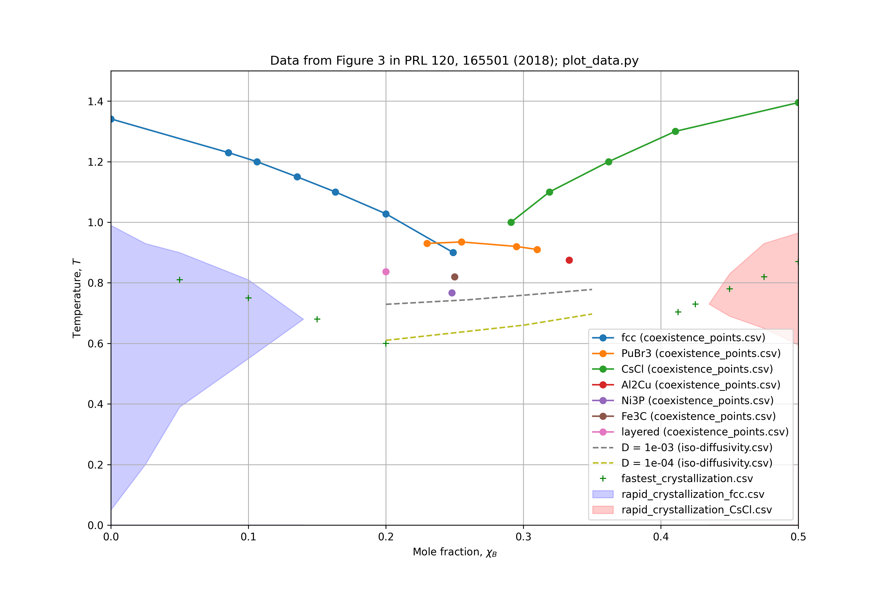

# Figure 3

## Data overview
This directory contains data and code to reproduce Figure 4 of the paper.

* `coexistence_points.csv` contains the coexistence line isobar $p=10.19$.
* `fastest_crystallization.csv` contains the temperature where the fastest crystallization occurs for each mole fraction $\chi_B$ (i.e. the nose of the TTT-plot).
* `iso-diffusivity.csv` contains state-points where the diffusivity is $D=10^{-3}$ or $D=10^{-3}$.
* `rapid_crystallization_CsCl.csv` are the boundaries for where the system rapidly crystallizes into the CsCl structure.
* `rapid_crystallization_fcc.csv` are the boundaries for where the system rapidly crystallizes into the fcc structure.

See CSV files and the Python script `plot_data.py` for more.

