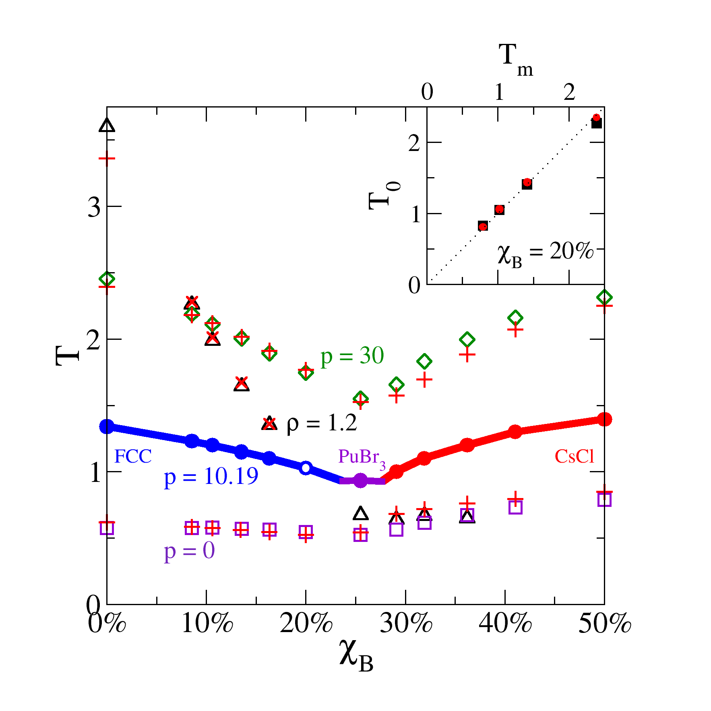
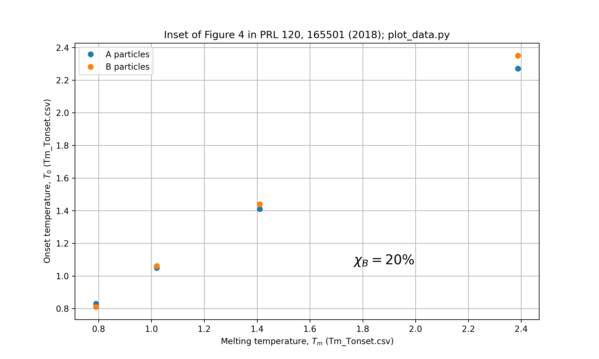
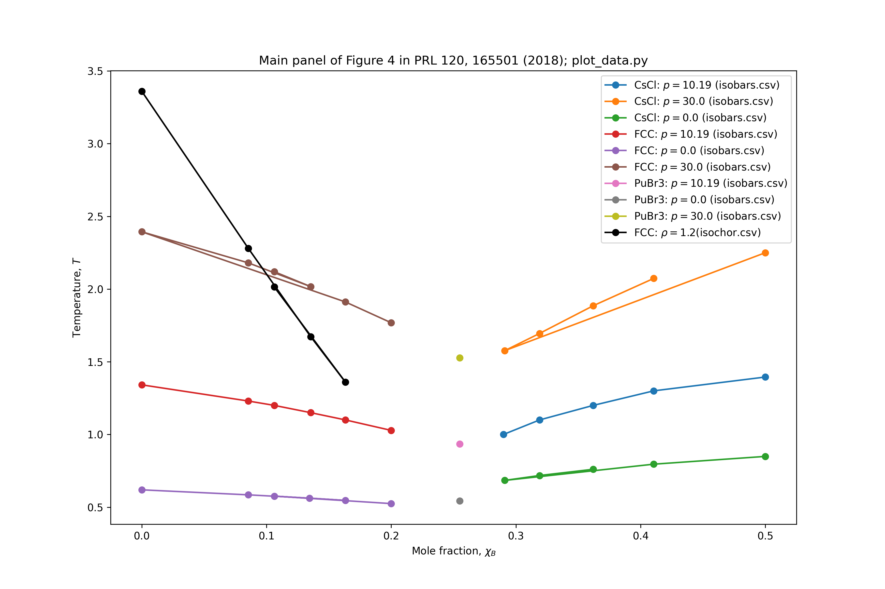
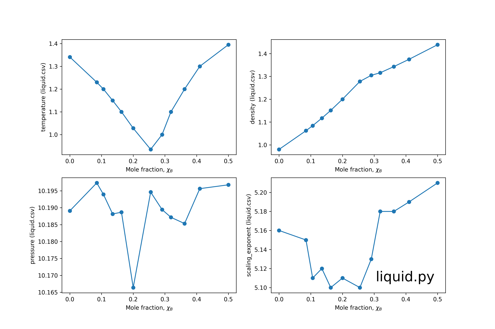

# Figure 4

## Data overview
This directory contains data and code to reproduce Figure 4 of the paper.

* `isobars.csv` contains the coexistence line three isobars, $p=(0, 10.19, 30)$.
* `isochors.csv` contains the coexistence line for the $\rho=1.2$ isochor.
* `liquid.csv` contains liquid properties along the $p=10.19$ isobar.
* `Tm_Tonset.csv` contains the melting and onset temperatures for the mole fraction $\chi_B=0.2$.

See CSV files and the Python script `plot_data.py` for more.

## Predictions from isomorph theory (in main panel)
The script `isomorph_theory.py` uses isomorph theory to predict the melting temperature at a desired pressure/density.
This theoretical prediction is shown in Figure 4.

We can predict the freezing temperature at other densities and pressures from properties at the reference pressure $p_0=10.19$ by assuming that 
1. pair interactions are sums of two power laws $r^{12}$ and $r^{6}$,
2. the potential energy function has "hidden scale-invariance" and,
3. the freezing line follows a liquid isomorph.

The first is a good approximation since Lennard-Jones interactions are truncated at a long distance of $r=2.5$. The second and third are good approximations (see references in the paper).

The melting temperature at some desired density $\rho$ is predicted from isomorph theory (see references in paper)

$$T = T_0 ( [\gamma_0/2 -1][\rho/\rho_0]^4-[\gamma_0/2 -2][\rho/\rho_0]^2 )$$

Here, the subscripts "0" refer to quantities of the liquid computed at the reference pressure $p_0$, which in our case is 10.19. 

The local density scaling exponent can be computed in a simulation with 

$$ \gamma=\langle\Delta U \Delta W\rangle/\langle (\Delta U)^2\rangle $$ 

where $U$ is the potential energy and $W$ is the virial, 
i.e., the potential part of the pressure: $p=\rho k_BT+W/V$. 

The prediction of the liquid pressure at the coexistence state point is

$$ p =\rho [k_BT + [2w_0-4u_0][\rho/\rho_0]^4+[4u_0-w_0][\rho/\rho_0]^2] $$

where $w=W/N$ and $u=U/N$, and $T$ is given by the above equation.

The needed data is in `liquid.csv`

See `isomorph_theory.py` for an implementation.

